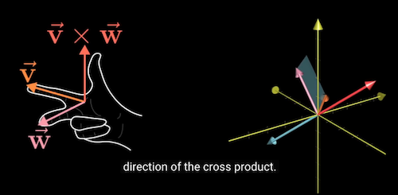
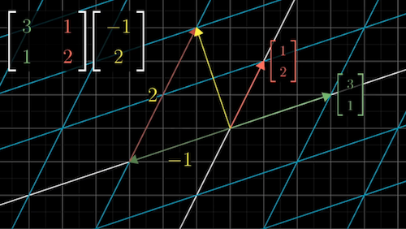

 

## Table of Contents
- [1. Vector](#vector)
- [2. Determinant](#determinant)
- [3. Dot products](#dot-products)
- [4. Cross products](#cross-products)
- [5. Cramer's rule](#cramer-rule)
- [6. Linear transformations](#transformations)
- [7. Matrix vector multiplication](#matrix-vector)
- [8. Matrix multiplication](#matrix-multiply)
- [9. Change of basis](#basis)
- [10. Eigenvectors and eigenvalues](#eigen)
- [11. Abstract vector spaces](#vector)
- [12. Questions](#questions)
- [13. Glossary](#glossary)
- [14. References](#references)

## 1. Vector
  * Imagine we have a two dimensional space composed of x and y axis, and their intersection called origin (0).
  * $\begin{bmatrix}1 \\\2 \end{bmatrix}$ : The coordinate of a vector is a pair of numbers which gives instructions to tell the vector how to get from the origin of the vector to the tip of the vector.
  * The first number tells you how far to walk on the x-axis
  * After that, the second number tells you how far to walk parallel to the y-axis
  * To differentiate vectors from points, the convention is to write these two numbers vertically in a square bracket.
  * Every pair of numbers is associated with one and only one vector, vice versa
  * [Vectors, what even are they? 3'- 4'](https://www.youtube.com/watch?v=fNk_zzaMoSs&list=PLZHQObOWTQDPD3MizzM2xVFitgF8hE_ab)

 

## 2. Determinant
### 2-D
  * $A = \begin{bmatrix}a&b \\\c&d \end{bmatrix}$
  * Determinant of $A$: $det(A)$
  * Numerically
    * a scalar value that can be computed from the elements of a square matrix and measures the scaling of linear transformation described by the matrix
    * $det(A)= ad-bc$
 * Geometrically
      * $det(A)$:the area scaling factor of the linear transformation
      * $\lvert det(A) \rvert > 1$, increase the area by a factor of 5
      * 0< $\lvert det(A) \rvert < 1$: squish down area
      * Zero determinant: when $det(A) =0$, the transformation squishes down the area to a line or a point
      * $det(A) < 0$:  the orientation of space is inverted (space is inverted. The basis vector $\vec{i}$ is now on the left side of $\vec{j}$)

### 3-D
  * $B = \begin{bmatrix}u_1&v_1&w_1 \\\u_2&v_2&w_2  \\\u_3&v_3&w_3 \end{bmatrix}$
  * Numerically:
    * $det(B)$: the volume scaling factor of the linear transformation described by the matrix
    * $det(B) = u_1(v2w3-w2v3)-v_1(u_2w_3-w_2u_3)+w_1(u_2v_3-v_2u_3)$
  * Geometrically  
    * $det(B) < 0$: Right finger rule no longer fits
        * index finger: points to the direction of $\vec{i}$
        * middle finger: points to the direction of $\vec{j}$
        * thumb: points to the direction of $\vec{k}$

 

## 3. Dot products
 * Two vectors of the same dimension
   * $\vec{v}$ =  $\begin{bmatrix}1 \\\2 \end{bmatrix}$

   * $\vec{w}$  = $\begin{bmatrix}3 \\\4 \end{bmatrix}$
 * Order: doesn't matter
 * Numerically
   * Pair the coordinates of multiply them together and add the result
   * $\begin{bmatrix}1 \\\2 \end{bmatrix}$ $\cdot$  $\begin{bmatrix}3 \\\4 \end{bmatrix}$ =  1 $\cdot$  3+ 2 $\cdot$ 4 = 11

 * Geometrically
   * Project $\vec{w}$ onto the line passing through the origin on the tip of $\vec{v}$  
   * $\vec{v}$ $\cdot$ $\vec{w}$  =  (length of projected  $\vec{w}$) $\cdot$ (length of projected  $\vec{v}$)
   * Dot product vs Directions
     *  $\vec{v}$ $\cdot$ $\vec{w}$> 0: vectors are pointing to similar directions
     *  $\vec{v}$ $\cdot$ $\vec{w}$< 0: vectors are pointing to opposing direction
     * $\vec{v}$ $\cdot$ $\vec{w}$ = 0: vectors are perpendicular

 * Duality: natural-but-surprising correspondence
   * Matrix vector product:  
     [$u_x$ $u_y$] $\begin{bmatrix}x \\\y \end{bmatrix}$ = $u_x$ $\cdot$ $x$ + $u_y$ $\cdot$ $y$
   * Dot product:   
     $\begin{bmatrix}u_x \\\u_y \end{bmatrix}$ $\cdot$ $\begin{bmatrix}x \\\y \end{bmatrix}$ = $u_x$ $\cdot$ $x$ + $u_y$ $\cdot$ $y$

  

[Screenshot at 2:19 in video](https://www.youtube.com/watch?v=LyGKycYT2v0&list=PLZHQObOWTQDPD3MizzM2xVFitgF8hE_ab&index=9)
 

## 4. Cross products
 * The standard basis vectors $\vec{i}$, $\vec{j}$, and $\vec{k}$
 * Two vectors of the same dimension
   * $\vec{v}$ =  $\begin{bmatrix}v_1 \\\v_2\\\v_3 \end{bmatrix}$

   * $\vec{w}$ = $\begin{bmatrix}w_1 \\\w_2 \\\w_3\end{bmatrix}$
 * Order: matters
 * Cross products
   *  $\vec{p}$ = $\vec{v}$ $\times$ $\vec{w}$
    *  $\vec{p}$ is a vector that is perpendicular to both $\vec{v}$ and $\vec{w}$  and thus normal to the plane containing them

 * $\vec{p}$ directions
   *  $\vec{p}$ > 0: when $\vec{v}$ is on the right side of $\vec{w}$
   *  $\vec{p}$ < 0: when $\vec{v}$ is on the left side of $\vec{w}$

 * Numerically
   * $\begin{bmatrix}v_1 \\\v_2\\\v_3 \end{bmatrix}$  $\times$ $\begin{bmatrix}w_1 \\\w_2 \\\w_3\end{bmatrix}$ = ($v_2w_3 -w_2v_3)\vec{i}$ + ($v_3w_1$ - $v_1w_3)\vec{j}$ + ($v_1w_2$ - $v_3w_1)\vec{k}$

 * Geometrically
   * The positive area of the parallelogram having $\vec{v}$ and $\vec{w}$ as sides
   * The length of $\vec{p}$ = the area of parallelogram defined by $\vec{v}$ and  $\vec{w}$
   * The direction of $\vec{p}$ is defined using the Right Hand Rule
      * index finger: points to the direction of $\vec{v}$
      * middle finger: points to the direction of $\vec{w}$
      * thumb: points to the direction of $\vec{p}$

  

[Screenshot at 6:03 in video](https://www.youtube.com/watch?v=eu6i7WJeinw&list=PLZHQObOWTQDPD3MizzM2xVFitgF8hE_ab&index=10)

 

## 5. Cramer's rule
* Cramer's rule expresses the solution in terms of the determinants of the (square) coefficient matrix and of matrices obtained from it by replacing one column by the column vector of right-hand-sides of the equations. It is named after Gabriel Cramer  
 * **Consider a system of linear equation**

 - $ax + by =e$  
$cx+dy=f$

 - $\frac{e-ax}{b}=\frac{f-cx}{a}$;  $x = \frac{ed-bf}{ad-bc}$  

 - $\frac {e-by} {a} = \frac{f-dy}{c}$;  $y = \frac{af-ec} {ad=bc}$

 * Matrix Equation
  - $\begin{bmatrix}a&b \\\c&d \end{bmatrix} \begin{bmatrix}x \\\y \end{bmatrix} =  \begin{bmatrix}e \\\f \end{bmatrix}$   

  - $x = \frac { \begin{array}{\| cc \|} e&b\\\ f&d\end{array} } { {\begin{array}{\|cc\|} a&b\\\c&d\end{array} } }$

  - $y = \frac { \begin{array}{\|cc\|} a&e\\\c&f\end{array} } { {\begin{array}{\|cc\|} a&b\\\c&d\end{array} } }$

 

## 6. Linear transformations
### What is linear transformation?
  - A function that takes an input vector and generates an output vector
  - The word 'transformation' suggests that we think using movement
  - The word 'Linear' suggests all spatial grid lines (for visualizing the coordinate system) must remain parallel and evenly spaced (not curvy), and the origin remains fixed  (not moving).

### What is a shear matrix?
A shear matrix is an elementary matrix that represents the addition of a multiple of one row or column to another.
  - $\begin{bmatrix}1&s \\\0&1 \end{bmatrix}$
  - $\begin{bmatrix}1&0 \\\s&1 \end{bmatrix}$

 

### How is matrix useful?
 * Computer graphics
 * Robotics: e.g. rotation  
 * Solve system equations: Linear system

 

## 7. Matrix vector multiplication
 * Numerically:
   - $\begin{bmatrix}a&b \\\c&d \end{bmatrix} \begin{bmatrix}x \\\y \end{bmatrix} =  x\begin{bmatrix}a \\\c \end{bmatrix} + y\begin{bmatrix}b \\\d \end{bmatrix} = \begin{bmatrix}{ax+by} \\\ {cx+dy} \end{bmatrix}$  
 * Geometrically: apply a transformation to a vector
   - Think of the columns of a matrix as transformed basis vectors $\begin{bmatrix}a \\\c \end{bmatrix}$ and $\begin{bmatrix}b \\\d \end{bmatrix}$
   - The linear trans result is the linear combination of the transformed basis vectors
   * 
  [Matrix Vector multiplication 8:00](https://www.youtube.com/watch?v=kYB8IZa5AuE&list=PLZHQObOWTQDPD3MizzM2xVFitgF8hE_ab&index=3)

 

## 8. Matrix multiplication
 * Numerically: Right to left
   - $\begin{bmatrix}a&b \\\c&d \end{bmatrix}\begin{bmatrix}e&f \\\g&h \end{bmatrix} =\begin{bmatrix}{ae+bg}&{af+bh} \\\ {ce+dg}&{cf+dh}\end{bmatrix}$
   - Step1: $\begin{bmatrix}a&b \\\c&d \end{bmatrix}\begin{bmatrix}e \\\g \end{bmatrix} =  e\begin{bmatrix}a \\\c \end{bmatrix} + g\begin{bmatrix}b \\\d \end{bmatrix} = \begin{bmatrix}{ae+bg} \\\ {ce+dg} \end{bmatrix}$
   - Step 2: $\begin{bmatrix}a&b \\\c&d \end{bmatrix}\begin{bmatrix}f \\\h \end{bmatrix} =  f\begin{bmatrix}a \\\c \end{bmatrix} + h\begin{bmatrix}b \\\d \end{bmatrix} = \begin{bmatrix}{af+bh} \\\ {cf+dh} \end{bmatrix}$
 * Geometrically:
   - $f(g(x))$
   - Composition: apply one transformation $f$ after another $g$
 * Order: matters $M_1M_2 \ne M_2M_1$
 * Associativity: $(AB)C=A(BC)$, meaning applying transformation C, B, and A

 

## 9. Change of basis
 * Translate between two coordinate systems
 * An inverse transformation $A^{-1}$ means: reverse the transformation
 * $A^{-1}MA$
    - $M$: a transformation in coordinate system P
    - $A^{-1}$ and $A$: mathematical sort of empathy
    - $A^{-1}MA$: mathematical product in coordinate system Q

 

## 10. Eigenvectors and eigenvalues
 * Eigenvector: a vector that stays on its own span (the line passing through the origin and the tip of the vector) during a matrix transformation, unlike other vectors that are knocked off their spans during transformation
 * Eigenvalue: The factor by which the eigengectors is stretched or squished
 * e.g. Matrix $A = \begin{bmatrix}3&1 \\\0&2 \end{bmatrix}$
 Eigenvector $\vec{v}$ =  $\begin{bmatrix}-1 \\\1 \end{bmatrix}$, eigenvalue of $\vec{v}$ is 2

 * 
[Eigenvector 3:39](https://www.youtube.com/watch?v=PFDu9oVAE-g&list=PLZHQObOWTQDPD3MizzM2xVFitgF8hE_ab&index=14)

 * The axis of a 3-D rotation: the span of an eigenvector, with eigenvalue equal to 1 (no stretching or squishing during rotation)

 * Eigenbasis: a set of basis vectors which are also eigenvectors
   - useful for matrix operations,
   - e.g. To calculate $\begin{bmatrix}3&1 \\\0&2 \end{bmatrix}^{100}$, change the basis vector to eigenbasis system $\begin{bmatrix}1&-1 \\\0&1 \end{bmatrix}$
   - $\begin{bmatrix}1&-1 \\\0&1 \end{bmatrix}^{-1}$ $\begin{bmatrix}3&1 \\\0&2 \end{bmatrix}$ $\begin{bmatrix}1&-1 \\\0&1 \end{bmatrix}$ = $\begin{bmatrix}3&0 \\\0&2 \end{bmatrix}$

 * How to calculate the eigenvalue of a matrix?
   - Matrix-vector multiplication $A\vec{v} = \lambda\vec{v}$ Scalar multiplication
   - Change the scalar multiplication to matrix multiplication ($I\vec{v}$) scaled by a factor $\lambda$
   - $A\vec{v} = \lambda I \vec{v}$; matrix-vector multiplication on both sides
   - $I = \begin{bmatrix}1 &0 \\\0&1 \end{bmatrix}$, the identity matrix with ones in the diagonal
   - $(A-\lambda I)\vec{v} = 0$
   - For non-zero $\vec{v}$, the transformation associated with the matrix has to be squished down to a lower dimension (squishification), which corresponds to a zero determinant of the matrix $det(A-\lambda I) = 0$
   - e.g.
     * For matrix $A = \begin{bmatrix}3&1 \\\0&2 \end{bmatrix}$
     * $\biggl(\begin{bmatrix}3&1 \\\0&2 \end{bmatrix} - \lambda\begin{bmatrix}1 &0 \\\0&1 \end{bmatrix}\biggr)\vec{v}=0$

     * $det \biggl(\begin{bmatrix}{3-\lambda}&1 \\\0&{2-\lambda } \end{bmatrix}\biggr) = 0$
     * $(3-\lambda)(2-\lambda)=0$
     * $\lambda$ can only be an eigenvalue, therefore, $\lambda=2$ or $\lambda=3$, which are the eigenvectors of matrix $A$    

 

## 11. Abstract vector spaces
 * Function: a type of vectors

 

## 12. Questions
 * What does a determinant of 0 mean for a matrix transformation?
   - $det(A)=0$
   - The matrix is squished down to a lower dimension
 * What kind of matrices have no eigenvalues?   
   - Non-square matrix
   - A skew-symmetric matrix (or anti-symmetric matrix) where $A^T=-A$

 * What properties do linear transformations have?
   - Linear transformations preserve addition and scalar multiplication
   - Preserving additivity: The result of adding two vectors and applying transformation to the sum is the same as adding the transformed vectors.   
   $L(\vec{v}+\vec{w})=L(\vec{v})+L(\vec{w})$
   - Preserving scaling: when you scale a vector by a scaler and then apply the transformation is the same as scaling the transformed vector.
   - These properties make it possible to represent any vector and do matrix multiplications.
   $L(c\vec{v})=cL(\vec{v})$

    

## 13. Glossary
 * Column space: all the linear combinations of the column vectors [Video by Sal Khan](https://www.khanacademy.org/math/linear-algebra/vectors-and-spaces/null-column-space/v/column-space-of-a-matrix)
 * Identity transformation: the transformation that does nothing
 * Gaussian elimination
 * Inverse matrices: the inverse transformation in geometry (clockwise-counterclockwise, rightward shear -- leftward shear)
 $A^{-1}*A^1=\begin{bmatrix}0&1 \\\1&0 \end{bmatrix}$
 * Rank: the number of dimensions in the output of a transformation (e.g. Rank 2: All vectors after a transformation land on a 2-D plain)
 * Null space (kernel): the space of all vectors becoming null  
 * Row echelon form
 * Span: the set of all linear combinations of two vectors.  
 * Symmetric matrix: $A^T=A$
 * Skew-symmetric matrix $A^T=-A$

  

---

## 14. References
  * [Cross product introduction](https://www.khanacademy.org/math/linear-algebra/vectors-and-spaces/dot-cross-products/v/linear-algebra-cross-product-introduction)
  * [Essence of linear algebra](https://www.youtube.com/watch?v=fNk_zzaMoSs&list=PLZHQObOWTQDPD3MizzM2xVFitgF8hE_ab)
  * [MIT Eigen](https://math.mit.edu/~gs/linearalgebra/ila0601.pdf)
  * [Eigenvalues and Eigenvectors](http://www.math.harvard.edu/archive/20_spring_05/handouts/ch05_notes.pdf)
  * [KSmith-EigenValues](http://www.math.lsa.umich.edu/~kesmith/EigenValues.pdf)
  * [Shears and one directional scaling](https://www.maa.org/external_archive/joma/Volume8/Kalman/Linear3.html)
