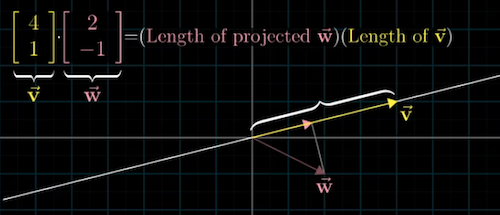

### Linear Algebra

------

#### What is a vector?
  * Imagine we have a two dimensional space composed of x and y axis, and their intersection called origin (0).
  *  : The coordinate of a vector is a pair of numbers which gives instructions to tell the vector how to get from the origin of the vector to the tip of the vector.
  * The first number tells you how far to walk on the x-axis
  * After that, the second number tells you how far to walk parallel to the y-axis
  * To differentiate vectors from points, the convention is to write these two numbers vertically in a square bracket.
  * Every pair of numbers is associated with one and only one vector, vice versa
  * [Vectors, what even are they? 3'- 4'](https://www.youtube.com/watch?v=fNk_zzaMoSs&list=PLZHQObOWTQDPD3MizzM2xVFitgF8hE_ab)

 

#### Matrix multiplication
 * Right to left (die Rechts-vor-links-Regel)

 

#### Dot products
 * Two vectors of the same dimension
   * $\vec{v}$ =  $\begin{bmatrix}1 \\\2 \end{bmatrix}$
   * $\vec{w}$  = $\begin{bmatrix}3 \\\4 \end{bmatrix}$
 * Numerically
   * Pair the coordinates of multiply them together and add the result

   * $\begin{bmatrix}1 \\\2 \end{bmatrix}$ $\cdot$  $\begin{bmatrix}3 \\\4 \end{bmatrix}$ =  1 $\cdot$  3+ 2 $\cdot$ 4= 11

 * Geometrically
   * Project $\vec{w}$ onto the line passing through the origin on the tip of $\vec{v}$  
   * $\vec{v}$ $\cdot$ $\vec{w}$  =  (length of projected  $\vec{w}$) $\cdot$ (length of projected  $\vec{v}$)
   * Dot product vs Directions
     *  $\vec{v}$ $\cdot$ $\vec{w}$> 0: vectors are pointing to similar directions
     *  $\vec{v}$ $\cdot$ $\vec{w}$> 0: vectors are pointing to opposing direction
     * $\vec{v}$ $\cdot$ $\vec{w}$ = 0: vectors are perpendicular

 * Duality: natural-but-surprising correspondence
   * Matrix vector product:  
     [$u_x$ $u_y$] $\begin{bmatrix}x \\\y \end{bmatrix}$ = $u_x$ $\cdot$ x + $u_y$ $\cdot$ y
   * Dot product:   
     $\begin{bmatrix}u_x \\\u_y \end{bmatrix}$ $\cdot$ $\begin{bmatrix}x \\\y \end{bmatrix}$ = $u_x$ $\cdot$ x + $u_y$ $\cdot$ y

#### Glossary
 * Column space: all the linear combinations of the column vectors [Video by Sal Khan](https://www.khanacademy.org/math/linear-algebra/vectors-and-spaces/null-column-space/v/column-space-of-a-matrix)
 * Determinant:
   * Geometrically: the determinant of matrix A, det(A), it can be viewed as the volume scaling factor of the linear transformation described by the matrix
 * Identity transformation: the transformation that does nothing
 * Gaussian elimination
 * Inverse matrices: the inverse transformation in geometry (clockwise-counterclockwise, rightward shear -- leftward shear)
 
 * Rank: the number of dimensions in the output of a transformation (e.g. Rank 2: All vectors after a transformation land on a 2-D plain)
 * Null space (kernel): the space of all vectors becoming null  
 * Row echelon form
 * Span: the set of all linear combinations of two vectors.  

#### How is matrices useful?
 * Computer space
 * Solve system equations: Linear system
