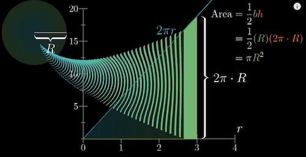
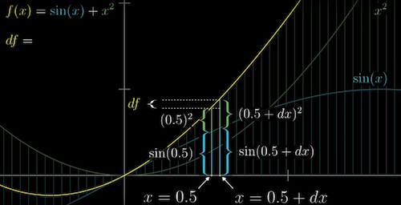

 

## Table of Contents
 - [1. Calculus](#calculus)
 - [2. Derivatives and integrals](#derivatives)
 - [3. The paradox of the derivative](#paradox)
 - [4. Chain rule and product rule](#chain)
 - [5. Derivatives of exponentials](#exponentials)
 - [6. Implicit differentiation](#implicit)
 - [7. Limits, L'Hopital's rule, and epsilon delta definitions](#limits)
 - [8. Integration and the fundamental theorem of calculus](#integral)
 - [9. The average of a continuous variable](#average)
 - [10. Higher order derivatives](#high-order)
 - [11. Taylor series](#taylor)
 - [12. References](#refs)

 

## 1. Calculus
  * A philosophy about concrete finitely small nudge
     
  [Fathers of calculus, 1:05](https://www.youtube.com/watch?v=9vKqVkMQHKk&list=PLZHQObOWTQDMsr9K-rj53DwVRMYO3t5Yr&index=2)

 

## 2. Derivatives and integrals
How to calculate the area of a circle?  
 * The area of a circle can be approximated to the aggregated areas of many rectangles ($2\pi rdr$, perimeter $2\pi r$ as the length*width $dr$)

 *   
 [Area 6:45](https://www.youtube.comwatch?v=WUvTyaaNkzM&list=PLZHQObOWTQDMsr9K-rj53DwVRMYO3t5Yr&index=1)

 

## 3. The paradox of the derivative
  - Derivative: to calculate the derivative at one time point (e.g. velocity), we actually need two time points (to calculate $\frac{Distance Change}{TimeChange}$)

  -   
[Derivative, 8:16](https://www.youtube.com/watch?v=9vKqVkMQHKk&list=PLZHQObOWTQDMsr9K-rj53DwVRMYO3t5Yr&index=2)  

 

  - Make the time point interval $\to$ 0
  - The derivative as an instaneous rate of change = The best constant approximation of the rate of change
  - The slope of the line tangent to the point at t $\to$

  -     
[Derivative example, 12:30](https://www.youtube.com/watch?v=9vKqVkMQHKk&list=PLZHQObOWTQDMsr9K-rj53DwVRMYO3t5Yr&index=2)

 

## 4. Chain rule and product rule
### 1) Sum rule: The derivative of a sum is the sum of derivatives
   * $\frac{d}{dx}(g(x)+h(x)) = \frac{dg}{dx} + \frac{dh}{dx}$
   * e.g. $\frac{d}{dx}(sin(x)+x^2 = cos(x) + 2x$

   *   
[Sum rule, 3:05](https://www.youtube.com/watch?v=YG15m2VwSjA&list=PLZHQObOWTQDMsr9K-rj53DwVRMYO3t5Yr&index=4)

 

### 2) Product rule: try to use an area for visualization
   * Numerically: Left d(Right) + Right d(Left)
   * $f(x) = g(x)h(x)$
   * $df = g(x)dh + h(x)dg$
   * $\frac{df}{dx} = g(x)\frac{dh}{dx} + h(x)\frac{dg}{dx}$

   *   
   [Product rule, 7:20](https://www.youtube.com/watch?v=YG15m2VwSjA&list=PLZHQObOWTQDMsr9K-rj53DwVRMYO3t5Yr&index=4)

 

### 3) Function composition
   * Chain Rule: $\frac{d}{dx}g(h(x)) = \frac{dg}{dg}(h(x))\frac{dh}{dx}(x)$
   * A small change in x $\to$ A small change in the intermediate number $\to$ Nudge the change in the final value

   *    
      [Chain rule, 11:37](https://www.youtube.com/watch?v=YG15m2VwSjA&list=PLZHQObOWTQDMsr9K-rj53DwVRMYO3t5Yr&index=4)

 

## 5. Derivatives of exponentials   
### 1) The Euler's number e
  - $e = 2.71828$
  - $M(t) = e^t$
  - Numerically: $\frac{dM}{dt}(t) =\frac{e^0.00000001 -1}{0.00000001} =e^t(1.000000000)$
  - Geometrically: The slope of a tangent line to any point on the $e^t$ graph equals the height of that point at the horizontal axis

  -    
     [Constant e, 8:52](https://www.youtube.com/watch?v=m2MIpDrF7Es&list=PLZHQObOWTQDMsr9K-rj53DwVRMYO3t5Yr&index=5)

 

### 2) Use the chain rule for other exponential functions
  - $2 = e^{(ln(2))}$
  - $2^t = e^{(ln(2))t}$, the exponential function of 2
  - $ln(2)2^t = ln(2)e^{ln(2)t}$, the derivative

 

## 6. Implicit differentiation  
  - Implicit curve: a plane curve defined by an implicit equation relating two coordinate variables, commonly x and y
  - Example
    * $x^2 + y^2 =5$ the implicit curve function
    * $2xdx + 2ydy = 0$ the implicit differentiation process. $0$ means we want $x^2 + y^2$ not change  
    * $\frac{dx}{dy} = \frac{-x}{y}$ the slope of the tangent line to the circle

    *   
    [Implicit curve, 3:03](https://www.youtube.com/watch?v=qb40J4N1fa4&list=PLZHQObOWTQDMsr9K-rj53DwVRMYO3t5Yr&index=6)

 

  - A related rates problem: how the rates of change for each of the values depend on each other  
  - Example
    * $x(t)^2 + y(t)^2 =5$ pythagorean theorem, x and y are functions of time, the top of the ladder $y$ is dropping at $1m/s$, find out the rate of the bottom of the ladder that is moving from the wall at the initial moment

    *     
      [Related rates, 7:12](https://www.youtube.com/watch?v=qb40J4N1fa4&list=PLZHQObOWTQDMsr9K-rj53DwVRMYO3t5Yr&index=6)    

 

  - Two more multivariable calculus problem: try to have a clear understanding of how what tiny nudges are playing and how they depend on each other
  - Example 1
    * $sin(x)y^2 =x$, represent a bunch of points $(x,y)$ on the curves
    * $sin(x)(2ydy) + y^2cos(x)dx = dx$ Geometrically, this means the left and the right side change must be the same to keep the points on the curves
    * $\frac{dy}{dx} = \frac{1-y^2}{2tan(x)y}$

    *     
      [Multi variable, 12:31](https://www.youtube.com/watch?v=qb40J4N1fa4&list=PLZHQObOWTQDMsr9K-rj53DwVRMYO3t5Yr&index=6)    

 

  - Example 2
    * $y =ln(x)$, $\frac{dy}{dx} = \frac{d(ln(x))}{dx}$  
    * $e^y =x$, $\frac{dy}{dx} = \frac{1}{x}$
    * $\frac{dy}{dx} = \frac{1}{x}$

    *          
    [Multi variable 2, 14:31](https://www.youtube.com/watch?v=qb40J4N1fa4&list=PLZHQObOWTQDMsr9K-rj53DwVRMYO3t5Yr&index=6)    

 

## 7. Limits, L'Hopital's rule, and epsilon delta definitions
  - The official definition of derivative
    * The rise-over-run slope between the starting point on the graph and the nudged point when the difference between the input and nudged input is close to 0 ($dx$)  
    * $$\frac{df}{dx}(x)=\lim_{dx\to 0}\frac{f(x+dx)-f(x)}{dx}$$
    * Replace dx with a commonly used variable h (or $\Delta x$ )
    * $$\frac{df}{dx}(x)=\lim_{h\to 0}\frac{f(x+h)-f(x)}{h}$$

 

  - The epsilon delta definition
    * The formalization of the notion of limit (one value approach to another)  
    * Baron Augustin-Louis Cauchy first used,  Bernard Bolzano gave the definition
    * The dependent expression f(x) approaches the value L as the variable x approaches the value c if f(x) can be made as close as desired to L by taking x sufficiently close to c.

    *          
    [Epsilon delta, 9:23](https://www.youtube.com/watch?v=kfF40MiS7zA&list=PLZHQObOWTQDMsr9K-rj53DwVRMYO3t5Yr&index=7)    

 

  -  L'Hopital's rule
     * Johann Bernoulli $\to$ Guillaume de l'Hôpital
     * When you are solving a limit, and get $0/0$ or $∞/∞$, L'Hôpital's rule is the tool you need
     * Conditions:
       * $$\lim_{x\to c}f(x) =\lim_{x\to c}g(x) =  0$$
       * $$\lim_{x\to c}f(x) =\lim_{x\to c}g(x) =  \pm \infty$$
     * Conclusion:   
       * $$\lim_{x\to c}\frac{f(x)}{g(x)} = \lim_{x\to c}\frac{f'(x)}{g'(x)}$$

 

## 8. Integration and the fundamental theorem of calculus
  - Integral: the fundamental theorem of calculus
    * The sum of a large number of small values on the continuum between the lower bound a and upper bound b
    * Given a function $f(x)$, find  $F(x)$, the antiderivative of $f(x)$
    * The reverse relation of derivative ($f(x)$ is the derivative of F ⟺  $f$ is an antiderivative of $f'$)
    * Calculate he integral of $f(x)$: $\int_a^b f(x)dx = F(b) - F(a)$
    * Each function has a family of antiderivatives (the difference between the family members is the constant $C$)
    * Geometrically: integrals don't measure the area per se, they measure the signed area   

    *          
    [Integral, 15:32](https://www.youtube.com/watch?v=rfG8ce4nNh0&list=PLZHQObOWTQDMsr9K-rj53DwVRMYO3t5Yr&index=8)

    *          
    [Integral example, 20:25](https://www.youtube.com/watch?v=rfG8ce4nNh0&list=PLZHQObOWTQDMsr9K-rj53DwVRMYO3t5Yr&index=8)  

    *          
    [Integral signed area, 20:45](https://www.youtube.com/watch?v=rfG8ce4nNh0&list=PLZHQObOWTQDMsr9K-rj53DwVRMYO3t5Yr&index=8)  

 

## 9. The average of a continuous variable
  - Cyclic phenomenon are modelled using sin waves
  - Example
    - Average height $= \frac{Area}{Width} = \frac{\int_0^\pi \sin(x)dx}{\pi}$

 

## 10. Higher order derivatives  

*          
[Higher-order derivative, 5:38](https://www.youtube.com/watch?v=BLkz5LGWihw&list=PLZHQObOWTQDMsr9K-rj53DwVRMYO3t5Yr&index=10)  

 

## 11. Taylor series
  * Scottish mathematician James Gregory and formally introduced by the English mathematician [Brook Taylor](https://en.wikipedia.org/wiki/Taylor_series)
  * Used for approximate functions: to find the polynomial functions for non-polynomial functions
  * A general nth-degree polynomial $f(x) = a_0 + a_1(x-c)+ a_2(x-c)^2 +a_3(x-c)^3+...$

    * Closed form: $f(x) =  	\sum_{j=0}^{\infty} a_j(x-c)^j$

  * $f(x) = \frac{f(c)}{0!} +\frac{f’(c)}{1!}(x-c) +\frac{f’’(c)}{2!}(x-c)^2 + \frac{f’’’(c)}{3!}(x-c)^3+...$

    * Closed form: $f(x) =  	\sum_{j=0}^{\infty} \frac{f^{(j)}(c)}{j!}(x-c)^j$

  * Maclaurin's series: when c=0

---
## 12. References
  * [Essence of calculus](https://www.youtube.com/playlist?list=PLZHQObOWTQDMsr9K-rj53DwVRMYO3t5Yr)
  * [L'Hôpital's rule introduction](https://www.khanacademy.org/math/ap-calculus-ab/ab-diff-contextual-applications-new/ab-4-7/v/introduction-to-l-hopital-s-rule  )  
  * [Antiderivatives and indefinite integrals](https://www.khanacademy.org/math/old-ap-calculus-ab/ab-antiderivatives-ftc)
  * [Taylor & Maclaurin polynomials intro (part 1)](https://www.khanacademy.org/math/ap-calculus-bc/bc-series-new/bc-10-11/v/maclaurin-and-taylor-series-intuition)
  * [Taylor Series](https://www.mathsisfun.com/algebra/taylor-series.html)
  * [An Easy Way to Remember the Taylor Series Expansion](https://medium.com/@andrew.chamberlain/an-easy-way-to-remember-the-taylor-series-expansion-a7c3f9101063)
