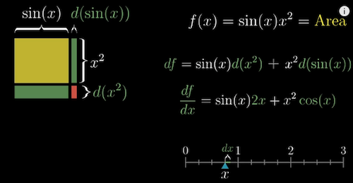
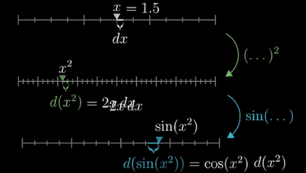

 

## Table of Contents
 - [Calculus](#calculus)
 - [Derivatives and integrals](#derivatives)
 - [The paradox of the derivative](#paradox)
 - [Chain rule and product rule](#chain)
 - [Derivatives of exponentials](#exponentials)
 - [Implicit differentiation](#Implicit)

 

## Calculus
     
  [Fathers of calculus, 1:05](https://www.youtube.com/watch?v=9vKqVkMQHKk&list=PLZHQObOWTQDMsr9K-rj53DwVRMYO3t5Yr&index=2)

 

## Derivatives and integrals
How to calculate the area of a circle?  
 * The area of a circle can be approximated to the aggregated areas of many rectangles ($2\pi rdr$, perimeter $2\pi r$ as the length*width $dr$)

 *   
 [Area 6:45](https://www.youtube.comwatch?v=WUvTyaaNkzM&list=PLZHQObOWTQDMsr9K-rj53DwVRMYO3t5Yr&index=1)

 

## The paradox of the derivative
  - Derivative: to calculate the derivative at one time point (e.g. velocity), we actually need two time points (to calculate $\frac{Distance Change}{TimeChange}$)
  -   
[Derivative, 8:16](https://www.youtube.com/watch?v=9vKqVkMQHKk&list=PLZHQObOWTQDMsr9K-rj53DwVRMYO3t5Yr&index=2)  

 

  - Make the time point interval $\to$ 0
  - The derivative as an instaneous rate of change = The best constant approximation of the rate of change
  - The slope of the line tangent to the point at t $\to$
  -     
[Derivative example, 12:30](https://www.youtube.com/watch?v=9vKqVkMQHKk&list=PLZHQObOWTQDMsr9K-rj53DwVRMYO3t5Yr&index=2)

 

## Chain rule and product rule
### 1) Sum rule: The derivative of a sum is the sum of derivatives
   * $\frac{d}{dx}(g(x)+h(x)) = \frac{dg}{dx} + \frac{dh}{dx}$
   * e.g. $\frac{d}{dx}(sin(x)+x^2 = cos(x) + 2x$
   *   
[Sum rule, 3:05](https://www.youtube.com/watch?v=YG15m2VwSjA&list=PLZHQObOWTQDMsr9K-rj53DwVRMYO3t5Yr&index=4)

 

### 2) Product rule: try to use an area for visualization
   * Numerically: Left d(Right) + Right d(Left)
   * $f(x) = g(x)h(x)$
   * $df = g(x)dh + h(x)dg$
   * $\frac{df}{dx} = g(x)\frac{dh}{dx} + h(x)\frac{dg}{dx}$

   *   
   [Product rule, 7:20](https://www.youtube.com/watch?v=YG15m2VwSjA&list=PLZHQObOWTQDMsr9K-rj53DwVRMYO3t5Yr&index=4)

 

### 3) Function composition
   * Chain Rule: $\frac{d}{dx}g(h(x)) = \frac{dg}{dg}(h(x))\frac{dh}{dx}(x)$
   * A small change in x $\to$ A small change in the intermediate number $\to$ Nudge the change in the final value
   *    
      [Chain rule, 11:37](https://www.youtube.com/watch?v=YG15m2VwSjA&list=PLZHQObOWTQDMsr9K-rj53DwVRMYO3t5Yr&index=4)

 

## Derivatives of exponentials   
### 1) The Euler's number e
  - $e = 2.71828$
  - $M(t) = e^t$
  - Numerically: $\frac{dM}{dt}(t) =\frac{e^0.00000001 -1}{0.00000001} =e^t(1.000000000)$
  - Geometrically: The slope of a tangent line to any point on the $e^t$ graph equals the height of that point at the horizontal axis
  -    
     [Constant e, 8:52](https://www.youtube.com/watch?v=m2MIpDrF7Es&list=PLZHQObOWTQDMsr9K-rj53DwVRMYO3t5Yr&index=5)

 

### 2) Use the chain rule for other exponential functions
  - $2 = e^{(ln(2))}$
  - $2^t = e^{(ln(2))t}$, the exponential function of 2
  - $ln(2)2^t = ln(2)e^{ln(2)t}$, the derivative

 

## Implicit differentiation  
  - Implicit curve: a plane curve defined by an implicit equation relating two coordinate variables, commonly x and y
  - Example
    * $x^2 + y^2 =5$ the implicit curve function
    * $2xdx + 2ydy = 0$ the implicit differentiation process. $0$ means we want $x^2 + y^2$ not change  
    * $\frac{dx}{dy} = \frac{-x}{y}$ the slope of the tangent line to the circle
    *   
    [Implicit curve, 3:03](https://www.youtube.com/watch?v=qb40J4N1fa4&list=PLZHQObOWTQDMsr9K-rj53DwVRMYO3t5Yr&index=6)

 

  - A related rates problem: how the rates of change for each of the values depend on each other  
  - Example
    * $x(t)^2 + y(t)^2 =5$ pythagorean theorem, x and y are functions of time, the top of the ladder $y$ is dropping at $1m/s$, find out the rate of the bottom of the ladder that is moving from the wall at the initial moment
    *     
      [Related rates, 7:12](https://www.youtube.com/watch?v=qb40J4N1fa4&list=PLZHQObOWTQDMsr9K-rj53DwVRMYO3t5Yr&index=6)    

 

  - Two more multivariable calculus problem: try to have a clear understanding of how what tiny nudges are playing and how they depend on each other
  - Example 1
    * $sin(x)y^2 =x$, represent a bunch of points $(x,y)$ on the curves
    * $sin(x)(2ydy) + y^2cos(x)dx = dx$ Geometrically, this means the left and the right side change must be the same to keep the points on the curves
    * $\frac{dy}{dx} = \frac{1-y^2}{{2tan(x)}{y}}$
    *     
      [Multi variable, 12:31](https://www.youtube.com/watch?v=qb40J4N1fa4&list=PLZHQObOWTQDMsr9K-rj53DwVRMYO3t5Yr&index=6)    

 

  - Example 2
    * $y =ln(x)$, $\frac{dy}{dx} = \frac{d(ln(x))}{dx}$  
    * $e^y =x$, $\frac{dy}{dx} = \frac{1}{x}$
    * $\frac{dy}{dx} = \frac{1}{x}$
    *          
    [Multi variable 2, 14:31](https://www.youtube.com/watch?v=qb40J4N1fa4&list=PLZHQObOWTQDMsr9K-rj53DwVRMYO3t5Yr&index=6)    
